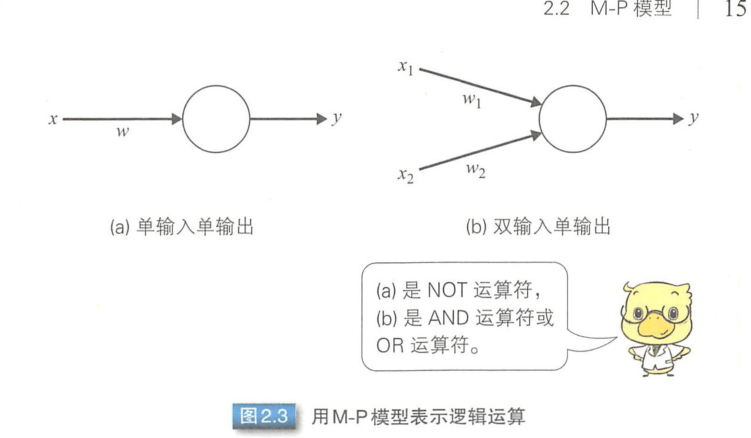
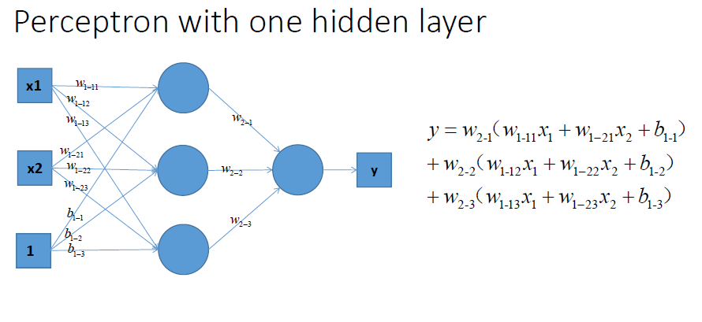
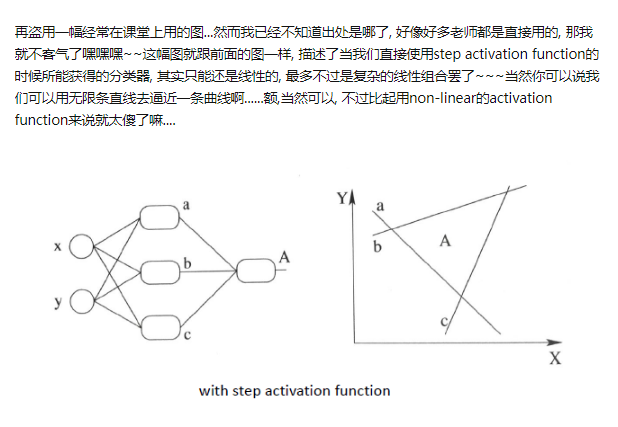
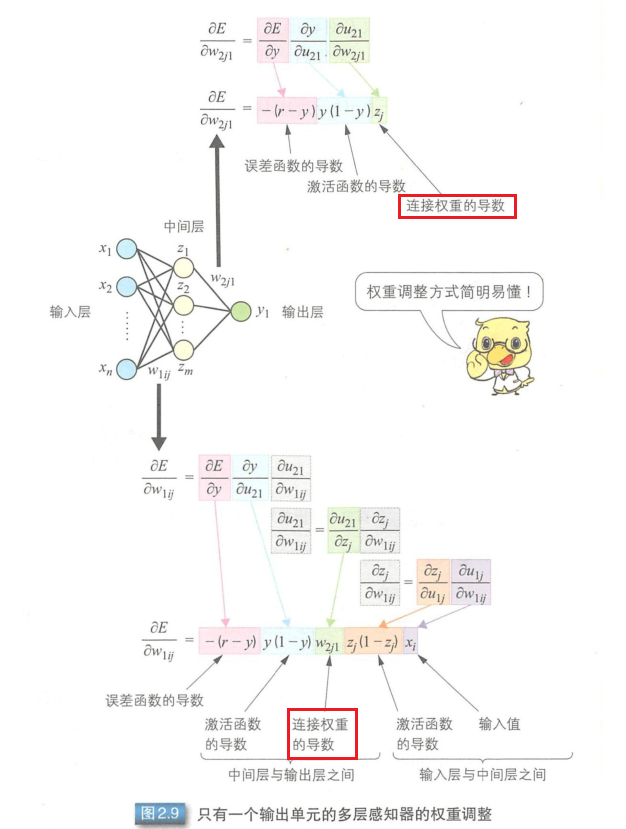
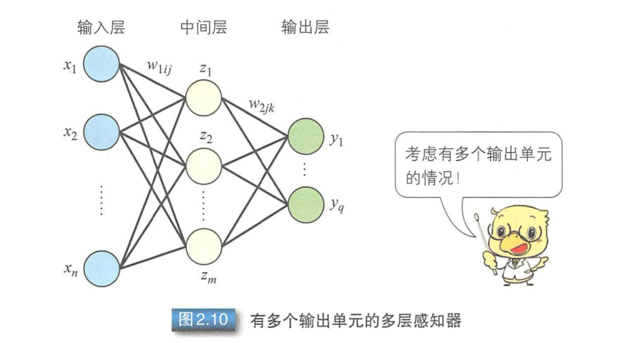
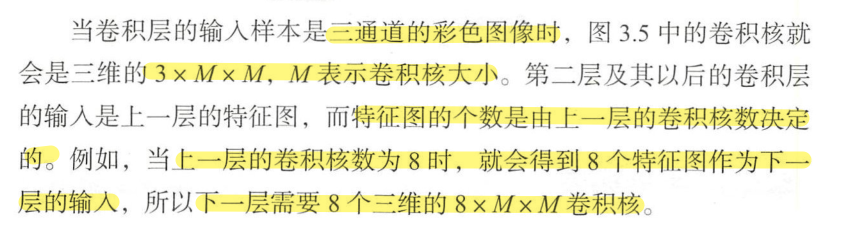

# 《图解深度学习》 读书笔记

---

## 第1章 绪论

### 1. 深度学习与机器学习

- 深度学习是一种机器学习方法
- 有监督学习和无监督学习
  - 大量数据训练网络，实现对给定的数据进行分类或递归
- 深度学习是一个多层网络结构，和人脑的认知结构相似

### 2. 深度学习的发展历程

- 深度学习方法直接打破了原有的性能极限：
  - 语音识别
  - 图像识别
- GPU支持并行处理

### 3. 为什么是深度学习

- 模仿人脑机制获取知识

| 以往的机器学习 | 深度学习                                                     |
| -------------- | ------------------------------------------------------------ |
| 手动设计特征值 | 通过学习大量数据自动确定需要提取的特征信息，甚至还能自动获取一些人类无法想象的组合出来的特征信息 |

- 即便是难度较高的认证问题也能得到绝佳的性能

### 4. 什么是深度学习

一般指具有多层结构的网络，不过对于网络的层数没有严格的定义，网络的生成方法也是多种多样的。

#### 4.1 分类方法

按起源分类：


两个起源：

1. 感知器——一种有监督学习，根据期望输出训练网络
2. 玻尔兹曼机——一种无监督学习，根据特定的训练数量训练网络


---

## 第2章 神经网络

### 1. 神经网络的历史

- 1943，对生物神经元进行建模：形式神经元模型，通过电阻等元件构建的物理网络得以实现-**M-P模型**
- 1958，提出感知器
  - 经过训练后，计算机能够确定神经元的连接权重
- 1969，提出：感知器无法解决线性不可分问题
  - 主要问题：感知器无法解决逻辑异或运算这样的线性不可分问题
  - 可以通过多层感知器解决，但是当时人们还不知道如何进行分层训练
- 1980s，提出误差反向传播算法（BP）
  - 通过设置多层感知器解决了线性不可分问题
- 1980s，神经认知机（Neocognitron）
  - 模拟了生物的视觉传导通路
- 将相当于生物初级视皮层的卷积层引入到神经网络中，提出卷积神经网络
- 支持向量机 SVM

### 2. M-P模型

是首个通过模仿神经元而形成的模型。在M-P模型中，多个输入节点${x_i|i=1,...,n}$ 对应一个输出节点y。每个输入$x_i$乘以相应的连接权重$w_i$，然后相加得到输出y。结果之和如果大于阈值h，则输出1，否则输出0。输入和输出均是0或1。
$$
y=f(\sum_{i=1}^{n}w_ix_i-h)
$$
M-P模型可以表示AND和OR等逻辑运算。M-P模型在表示各种逻辑运算是，可以转化为单输入单输出或双输入单输出的模型。




逻辑或（OR）和逻辑与（AND）可以使用右侧图的模型来表示。

以OR运算为例时，公式$w_i$和$h$​分别为
$$
w_1 = 1, w_2 = 1, h = 0.5
$$
所以意思就是：

```
if x1+x2>0.5 :
     then y=1
else:
	y=0
```

OR: 
$$
y=f(x_1+x_2-0.5)
$$
同理，AND运算是$w_1=1,\ w_2=1,\ h=1.5$。代入到公式中可以得到：
$$
y=f(x_1+x_2-1.5)
$$
由此可见，使用M-P可以进行逻辑运算。但是，上述的$w_i$和$h$是如何确定的呢？

当时还没有通过对训练样本进行训练来确定参数的方法，只能人为实现计算后确定。

此外，M-P模型已通过电阻得到了物理实现。

### 3. 感知器

前面提到的逻辑运算符比较简单，还可以人为事先确定参数，但逻辑运算符$w_i$和$h$的组合并不仅仅限于前面提到的这几种。罗森布拉特提出的感知器能够根据训练样本自动获取样本的组合。

**与 M-P模型需要人为确定参数不同，感知器能够通过训练自动确定参数 **。

训练方式为有监督学习，即需要设定训练样本和期望输出，然后调整实际输出和期望输出之差的方式（误差修正学习）。 

误差修正学习可用下面的公式来表示：
$$
w_i←w_i+a(r-y)x_i \\
h←h-a(r-y)
$$
$a$是确定连接权重调整值的参数。$a$增大则误差修正速度增加，$a$减小则误差修正速度降低。

简单来说，$a$是用来控制调整速度的，太大会影响训练的稳定性，太小则使训练的收敛速度变慢。 

感知器中调整权重的基本思路如下所示：

- 实际输出$y$与期望输出$r$相等时，$w_i$和$h$不变
- 实际输出$y$与期望输出$r$不相等时，调整$w_i$和$h$的值

参数$w_i$和$h$的调整包括下面这两种情况 。
1. 实际输出$y=0$、期望输出$r=1$时 （未激活）
- 减小$h$
- 增大$x_i=1$的连接权重$w_i$
- $x_i=0$的连接权重不变
2. 实际输出$y=1$、期望输出$r=0$时 （激活过度）
- 增大$h$
- 降低$x_i=1$的连接权重$w_i$
- $x_i=0$的连接权重不变

训练过程：


因为感知器会利用随机数来初始化各项参数，所以训练得到的参数可能并不相同 。

感知器训练只能解决线性可分问题，不能解决线性不可分问题。 为了解决线性不可分问题，我们需要使用多层感知器 。


### 4. 多层感知器

多层感知器指的是由多层结构的感知器递阶组成的输入值向前传播的网络，也被称为前馈网络或正向传播网络 。

- 多层感知器通常采用三层结构，由输入层、中间层及输出层组成 。

- 中间层的感知器通过权重与输入层的各单元（ unit ）相连接，通过阈值函数计算中间层各单元的输出值。
  - 中间层与输出层之间同样是通过权重相连接。

- 多层感知器也可以通过误差修正学习确定两层之间的连接权重 。
  - 误差修正学习不能跨层调整，无法进行多层训练

> 简单来说：

> 1. 单层感知器，很简单一个结构，输入层和输出层直接相连。
>
> 2. 相对于单层感知器，多层感知器输出端从一个变成了多个；输入端和输出端之间也不光只有一层，现在有两层：输出层和隐藏层。

因此，初期的多层感知器使用随机数确定输入层与中间层之间的连接权重，只对中间层与输出层之间的连接权重进行误差修正学习 。 所以，就会出现输入数据虽然不同，但是中间层的输出值却相同，以至于无法准确分类的情况。那么，多层网络中应该如何训练连接权重呢？人
们提出了误差反向传播算法 。


### 5. 误差反向传播算法

是通过比较实际输出和期望输出得到误差信号，把误差信号从输出层逐层向前传播得到各层的误差信号，再通过调整各层的连接权重以减小误差 。

权重的调整主要使用梯度下降法。

通过实际输出和期望输出之间的误差$E$和梯度，确定连接权重$w^0$的调整值，得到新的连接
权重$w^1$。然后像这样不断地调整权重以便误差达到最小，从中学习得到最优的连接权重$w^{opt}$。这就是梯度下降法。


- 计算误差可以使用最小二乘误差函数，通过期望输出$r$和网络的实际输出$y$计算最小二乘误差函数$E$。

- $E$趋近于0，表示实际输出与期望输出更加接近。
- 误差大时增大调整值，误差小时减小调整值

连接权重调整值 ：
$$
\Delta w=-\eta \frac{\partial E}{\partial w}
$$
$\eta$表示学习率，这个值用于根据误差的程度进行权重调整。

学习率决定了参数移动到最优值的速度快慢。如果学习率过大，很可能会越过最优值；反之，如果学习率过小，优化的效率可能降低，收敛速度会很慢。

激活函数：

- M-P中，使用step函数作为激活函数，只能输出0或1，不连续所以不可导。
- 为了使误差能够传播，鲁梅尔哈特等人提出使用可导函数sigmoid作为激活函数$f(u)$。

$$
f(u)=\frac{1}{1+e^{-u}}
$$

在人工神经网络中，一个节点的激活函数定义了该节点在给定的输入或输入集合下的输出。标准的计算机芯片电路可以看作是根据输入得到开（1）或关（0）输出的数字电路激活函数。因此，激活函数是确定神经网络输出的数学方程式。

激活函数是用来加入非线性因素的，因为线性模型的表达能力不够。


线性：






计算后可知，权重调整值如下所示：
$$
\Delta w_{ij}=\eta (r_j - y_j)y_j(1-y_j)x_i
$$
由上可知，==多层感知器中，只需使用与连接权重$w_{ij}$相关的输入$x_i$和输出$y_i$，即可计算连接权重调整值。==


-》 **链式法则** chain rule



有多个输出单元的多层感知器：


$$
\frac{\partial E}{\partial w_{2jk}}=\frac{\partial E}{\partial y_k}\frac{\partial y_k}{\partial u_{2k}}\frac{\partial u_{2k}}{w_{2jk}}
$$
(对连接权重求导，首先考虑到==输出层与中间层之间==的连接权重)

接下来再对==输入层与中间层==之间的连接权重求导：


u远小于0时，y值趋近于零；所以，权重调整公式中==对sigmoid函数求导==后所得到的函数趋近于0。

反之，u远大于1时，y值趋近于1；所以，sigmoid函数求导后所得到的函数仍然趋近于0。

所以在上述情况时，是无法调整连接权重的。

这就是误差传播算法中==梯度消失==导致无法调整权重的问题。对于这个问题，需要==在训练过程中调整学习率$\eta$==以防止梯度消失。

### 6. 误差函数和激活函数

#### 6.1 可以作为误差函数的func

在==多分类问题==中，一般使用交叉熵代价函数：
$$
E=-\sum^C_{c=1}\sum^N_{n=1}r_{cn}\ \text{ln}\ y_{cn}
$$
==二分类问题==中的函数则如下所示：
$$
E=-\sum^N_{n=1}\{r_n\ \text{ln}\ y_n+(1-r_n)\ \text{ln}(1-y_n)\}
$$
==递归问题==，最小二乘误差函数：
$$
E=\sum^N_{n=1}||r_n-y_n||^2
$$
我们也可以根据实际问题自行定义误差函数。

#### 6.2 激活函数

激活函数类似于人类神经元，对输入信号进行线性或非线性变换。

- M-P：step func
- 多层感知器：sigmoid func        $f(u)=\frac{1}{1+e^{-u}}$

这里，用输入层与中间层之间，或中间层与输出层之间的连接权重$w_i$乘以相应单元的输入值$x_i$，并将该乘积之和经sigmoid函数计算后得到激活值$u$​。
$$
u=\sum^n_{i=1}w_ix_i
$$


除==sigmoid func==之外，激活函数还可以使用==tanh func（双曲正切）==。设f（u）是tanh func，则：
$$
f'(u)=1-f(u)^2
$$
tanh是一个单调函数，曲线形状与sigmoid相似。

==修正线性单元ReLU==也是一种激活函数。


$$
f(u)=max(u,0)
$$
如果 u 小于或等于0则输出0，如果 u 大于或等于0，则线性输出u的值（即输入等于输出）。u>0时求导：
$$
f'(u)=1
$$
其他情况下的结果为零，不更新连接权重。

### 7. 似然函数

我们可以根据问题的种类选择似然函数，计算多层感知器的输出结果 。

多分类问题中通常以==softmax函数==作为似然函数。
$$
p(y^k)=\frac{\text{exp}(u_{2k})}{\sum^Q_{q=1}\text{exp}(u_{2q})}
$$
softmax func分母：对输出层所有单元（q=1...Q）的激活值进行求和，起到归一化作用；输出层中每个单元取值都是介于0和1之间的概率值 ，我们选择其中概率值最大的类别作为最终分类结果输出。

==递归问题中，有时会使用线性输出函数作为似然函数。==线性输出函数会把激活值$u_{2k}$作为结果直接输出。输出层各单元的取值仍是介于0和1之间 。

### 8. 随机梯度下降法


#### 8.1 批量学习（ batch learning ）算法

批量梯度下降法。BGD

- 需要在每次迭代计算时遍历全部训练样本。


- 有效抑制训练集内带噪声的样本所导致的输入模式剧烈变动
- 训练用时较长

#### 8.2 在线学习（ sequential learning 或 online learning ）算法

随机梯度下降法。SGD


- 训练样本的差异会导致迭代结果出现大幅变动，迭代结果的变动可能导致训练无法收敛
- 迭代计算时可以逐渐降低学习率$\eta$（仍然会存在收敛速度缓慢甚至无法收敛的情况 ）

#### 8.3 小批量梯度下降法（ mini batch learning ） 

- 介于在线学习和批量学习之间

- ==将训练集分成几个子集 D==，每次迭代使用一个子集

$$
E^t=\sum_{n\in D}E^t_{n}
$$

全部子集迭代完成后，再次从第一个子集开始迭代调整连接权重 。 由于每次迭代只使用少量样本，所以和批量学习相比，小批量梯度下降法能够缩短单次训练时间 。 

- 使用一个以上而又不是全部的训练样本。

> 在算法的每一步，我们从具有 ![[公式]](https://www.zhihu.com/equation?tex=m) 个样本的**训练集（已经打乱样本的顺序）**中**随机抽出**一小批量(mini-batch)样本 ![[公式]](https://www.zhihu.com/equation?tex=X%3D%28x%5E%7B%281%29%7D%2C...%2Cx%5E%7B%28m%5E%7B%27%7D%29%7D%29) 。小批量的数目 ![[公式]](https://www.zhihu.com/equation?tex=m%5E%7B%E2%80%99%7D) 通常是一个相对较小的数（从1到几百）。重要的是，当训练集大小 ![[公式]](https://www.zhihu.com/equation?tex=m) 增长时，![[公式]](https://www.zhihu.com/equation?tex=m%5E%7B%E2%80%99%7D)通常是固定的。我们可能在拟合几十亿的样本时，每次更新计算只用到几百个样本。

mini-batch的SGD算法中一个关键参数是**学习率**。在实践中，有必要==**随着时间的推移逐渐降低学习率—学习率衰减**(learning rate decay)==。

- **为什么要进行学习率衰减呢？**

在梯度下降初期，能接受较大的步长（学习率），以较快的速度进行梯度下降。==当收敛时，我们希望步长小一点，并且在最小值附近小幅摆动。==假设模型已经接近梯度较小的区域，若保持原来的学习率，只能在最优点附近徘徊。如果降低学习率，目标函数能够进一步降低，有助于算法的收敛，更容易接近最优解。

- 小批量梯度下降法能够同时弥补在线学习（SGD？）和批量学习（BGD？）的缺点

（mini-batch，SGD）

### 9. 学习率$\eta$

- 用来确定权重连接调整程度的系数

- 随机梯度下降法中的计算结果乘以学习率，可得到权重调整值 

多数时候我们会根据经验确定学习率，首先设定一个较大的值，再慢慢把这个值减小，这是比较有效的方法 。 

另外还可以自适应调整学习率，例如使用 Ada Grad 方法。用学习率除以截至当前时刻 $t$ 的梯度 $\triangledown E$ 的累积值,得到神经网络的连接权重 $w$ 。
$$
w^{(t+1)}=w-\frac{\eta}{\sqrt{\sum^t_{i=1}(\triangledown E^{(i)})^2}+\varepsilon}\triangledown E^{(t)}
$$
Ada Grad 方法会对网络参数逐个进行梯度累积，能够为每个参数分配不同的学习率。使用该方法时虽然能够快速收敛，但是存在参数学习率不断衰减的问题。 

除此之外，我们还可以使用AdaDelta方法和动量（momentum）方法 。AdaDelta 方法在求梯度累积值时只使用距离当前时刻比较近的梯度，而动量方法中，则是以指数级衰减的形式累积之前参数的梯度 。

### 10. 小结

本章介绍的神经网络是理解深度学习的基础。神经网络由输入层、中间层以及输出层组成，各层之间通过权重连接。误差反向传播算法会迭代调整连接权重，直到收敛得到最优解。需要注意的是，由于不是每次训练都能得到收敛，所以要根据实际问题设定学习率和小批量训练的样本数等。


## 第3章 卷积神经网络

- 以图像识别为中心、多个领域都得到广泛应用的深度学习方法
- 卷积神经网络的
  - 结构
  - 每层的训练方法
    - 需要设定的参数种类
    - 不同参数设定方法所引起的性能差异

### 1. 卷积神经网络的结构

- 神经认知机中，如果没有任何细胞对输入模式做出反应，就采用增加细胞的学习规则。通过引入神经网络中的误差反向传播算法，人们得到了卷积神经网络（ Convolutional Neural Network ，CNN )。

卷积神经网络主要由这几类层构成：输入层、卷积层，池化（Pooling）层、全连接层、输出层。


- 通过增加卷积层和池化层，还可以得到更深层次的网络，其后的全连接层也可以采用多层结构 。

### 2. 卷积层

- 卷积神经网络中的卷积操作可以看作是输入样本和卷积核的内积运算。

- 在第一层卷积层对输入样本进行卷积操作后 ， 就可以得到==特征图==。

在第二层及其以后的卷积层，把==前一层的特征图作为输入数据==，同样进行卷积操作。


特征图的尺寸会小于输入样本，为了得到和原始输入样本大小相同的特征图，可以采用对输入样本进行填充（ padding）处理后再进行卷积操作的方法。 

零填充（ zero-padding ）指的就是用 0 填充输入样本的边界，填充大小为 P = (F -1 )/2 ，其中 F 为卷积核尺寸。 

在图 3.4 中，卷积核的滑动步长为1 。 我们也可以设定更大的滑动步长，==步长越大则特征图越小== 。

另外，卷积结果不能直接作为特征图，==需通过激活函数计算后，把函数输出结果作为特征图==。

常见的激活函数包括上一章介绍的 sigmoid 、tanh 、ReLU 等函数 。 

一个卷积层中可以有多个不同的卷积核，而每一个卷积核都对应一个特征图。




### 3. 池化层

池化层的作用是减小卷积层产生的特征图的尺寸。

池化操作降低了特征图的维度，使得特征表示对输入数据的位置变化具有稳健性 。 

- 最大池化：选取图像区域内的最大值作为新的特征图
- 平均池化：取图像区域内的平均值作为新的特征图
- Lp 池化：突出图像区域内的中央值而计算新的特征图


### 4. 全连接层

和多层感知器一样，全连接层也是==首先计算激活值==，然后==通过激活函数计算各单元的输出值==。

激活函数包括上一章介绍的 sigmoid 、tanh 、ReLU 等函数 。

